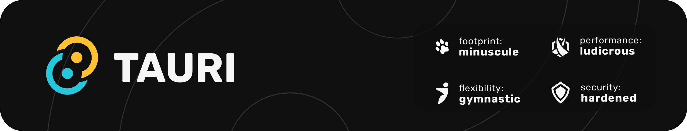

 
# Link Organizer

A simple link organizer built with Tauri, React and Typescript.
Let you manage your links in a simple way.

|| Lin | Win | Mac |
|-| -| - | - |
|| ✅ | ✅ | ✅ |

### Tauri + React + Typescript

This template should help get you started developing with Tauri, React and Typescript in Vite.

### Recommended IDE Setup

- [VS Code](https://code.visualstudio.com/) + [Tauri](https://marketplace.visualstudio.com/items?itemName=tauri-apps.tauri-vscode) + [rust-analyzer](https://marketplace.visualstudio.com/items?itemName=rust-lang.rust-analyzer)
